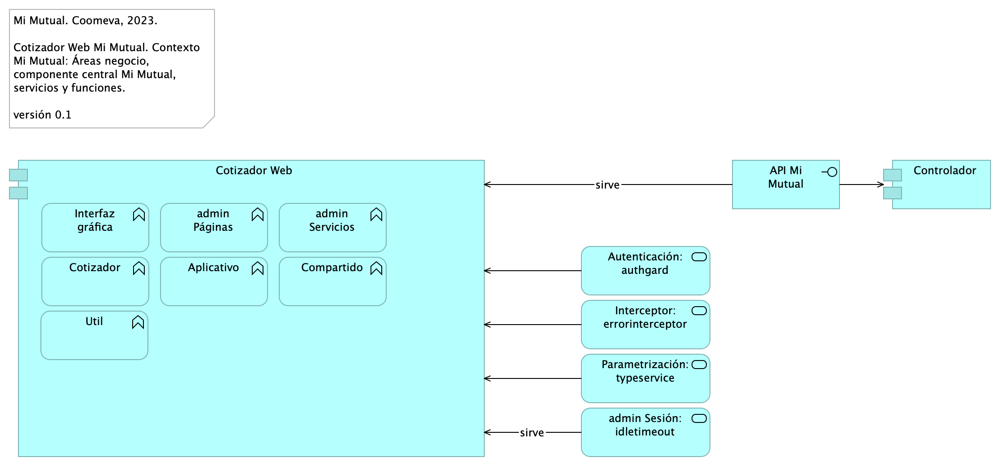

---
keywords:
- SOA
- madurez
- gobierno
- Coomeva
lang: en-US
date-meta: '2023-10-12'
author-meta:
- Equipo arquitectura STEF-COOMV.
header-includes: |
  <!--
  Manubot generated metadata rendered from header-includes-template.html.
  Suggest improvements at https://github.com/manubot/manubot/blob/main/manubot/process/header-includes-template.html
  -->
  <meta name="dc.format" content="text/html" />
  <meta property="og:type" content="article" />
  <meta name="dc.date" content="2023-10-12" />
  <meta name="citation_publication_date" content="2023-10-12" />
  <meta property="article:published_time" content="2023-10-12" />
  <meta name="dc.modified" content="2023-10-12T03:08:21+00:00" />
  <meta property="article:modified_time" content="2023-10-12T03:08:21+00:00" />
  <meta name="dc.language" content="en-US" />
  <meta name="citation_language" content="en-US" />
  <meta name="dc.relation.ispartof" content="Manubot" />
  <meta name="dc.publisher" content="Manubot" />
  <meta name="citation_journal_title" content="Manubot" />
  <meta name="citation_technical_report_institution" content="Manubot" />
  <meta name="citation_author" content="Equipo arquitectura STEF-COOMV." />
  <meta name="citation_author_institution" content="Arquitecto, Stefanini" />
  <link rel="canonical" href="https://hwong23.github.io/stef-mmt-cotiz/" />
  <meta property="og:url" content="https://hwong23.github.io/stef-mmt-cotiz/" />
  <meta property="twitter:url" content="https://hwong23.github.io/stef-mmt-cotiz/" />
  <meta name="citation_fulltext_html_url" content="https://hwong23.github.io/stef-mmt-cotiz/" />
  <meta name="citation_pdf_url" content="https://hwong23.github.io/stef-mmt-cotiz/manuscript.pdf" />
  <link rel="alternate" type="application/pdf" href="https://hwong23.github.io/stef-mmt-cotiz/manuscript.pdf" />
  <link rel="alternate" type="text/html" href="https://hwong23.github.io/stef-mmt-cotiz/v/a6e73d674bbcb8e209fc57022b9bd69616764d2e/" />
  <meta name="manubot_html_url_versioned" content="https://hwong23.github.io/stef-mmt-cotiz/v/a6e73d674bbcb8e209fc57022b9bd69616764d2e/" />
  <meta name="manubot_pdf_url_versioned" content="https://hwong23.github.io/stef-mmt-cotiz/v/a6e73d674bbcb8e209fc57022b9bd69616764d2e/manuscript.pdf" />
  <meta property="og:type" content="article" />
  <meta property="twitter:card" content="summary_large_image" />
  <link rel="icon" type="image/png" sizes="192x192" href="https://manubot.org/favicon-192x192.png" />
  <link rel="mask-icon" href="https://manubot.org/safari-pinned-tab.svg" color="#ad1457" />
  <meta name="theme-color" content="#ad1457" />
  <!-- end Manubot generated metadata -->
bibliography:
- content/manual-references.bib
- content/manual-references.json
manubot-output-bibliography: output/references.json
manubot-output-citekeys: output/citations.tsv
manubot-requests-cache-path: ci/cache/requests-cache
manubot-clear-requests-cache: false
...

---
title: Documento de Arquitectura Mi Mutual, Sistema de Previsión, Asistencia y Solidaridad, Coomeva, STEF - Coomeva
subtitle: Mi Mutual Coomeva - Mi Mutual, Sistema de Previsión, Asistencia y Solidaridad, Coomeva
geometry:
  - top=1in
  - bottom=1in
fignos-cleveref: True
fignos-plus-name: Fig.
fignos-caption-name: Imagen
tablenos-caption-name: Tabla
...

 

 

 

 

 

 

| **Versión** del producto 1.a6e73d6 de 12 Oct 2023

| **Presentado a**

| STEF - Coomeva

|

| **Fecha**

| 12 Oct 2023

\newpage

<small><em>Los productos de esta etapa, MiMutual - Modificación Core Unidad de Solidaridad y Seguros, Contrato XXX-2023, 
([Web](https://hwong23.github.io/stef-mmt-cotiz/v/a6e73d674bbcb8e209fc57022b9bd69616764d2e/))
están basados en el resultado del proyecto Coomeva Mi Mutual en curso.
[Sharepoint STEF@a6e73d6](http://stefanini.sharepoint.com)
del October 12, 2023.
</em></small>

 

## Autores

+ **Equipo arquitectura STEF-COOMV.**
   
    · {.inline_icon width=16 height=16}
    [e_hwong](https://github.com/e_hwong)
     
  <small>
     Arquitecto, Stefanini
  </small>

::: {#correspondence}
✉ — Enviar mensajes a Equipo arquitectura STEF-COOMV. \<e_hwong@stefanini.com\>.

:::

 

## Objetivo del Documento
Descripción de los productos del trabajo de arquitectura del proyecto MI MUTUAL de la Coomeva, Contrato XXX-2023. El principal propósito de este documento es informar de las decisiones sobre la disposición lógica y física de las partes del sistema. Por tanto, el documento contiene información estratégica, siendo en algunos casos el diseño detallado. Puntualmente, el documento refleja decisiones sobre la plataforma tecnológica seleccionada, así como consideraciones importantes para el diseño y desarrollo, con procura de garantizar una solución técnicamente viable y óptima para el proyecto.

 

##  Control de Cambios {.page_break_before}
| Tema           | Mi Mutual Coomeva Mi Mutual, Sistema de Previsión, Asistencia y Solidaridad, Coomeva      |
|----------------|----------------------------|
| Palabras clave | SIU, Stefanini, Coomeva, Análisis de brecha, GAP, Comparativa              |
| Autor          |                            |
| Fuente         |                            |
| Versión        | 1.a6e73d6 del 12 Oct 2023 |
| Vínculos       | [N003a Vista Segmento Coomeva SIU](N03a%a20Vsta%20aSegenta%20SOA%20Coomeva.md) |

 

 

\newpage

## Contenidos
\toc

 

\newpage

# Introducción

## Propósito
Este documento tiene como propósito presentar la arquitectura del aplicativo Mi Mutual para STEF - Coomeva. según los requerimientos definidos durante la etapa de preventa y luego detallados en las historias de usuario.

La arquitectura será una guía para que el diseño y la implementación de los componentes que conforman la solución sean cobijados bajo lineamientos y premisas bien definidos, permitiendo a los elementos del sistema interactuar entre sí de forma coherente. La arquitectura será tomada como un diseño estratégico que establece restricciones globales para el diseño, define un marco inicial de trabajo para la implementación de los requerimientos funcionales y no funcionales.

La definición arquitectónica de este proyecto será un proceso evolutivo como tal. Este documento puede ser susceptible a cambios a medida que se vayan agregando nuevas funcionalidades o requisitos al sistema.

Uno de los principales propósitos de este documento es hacer una representación de las decisiones de disposición lógica y física de las partes del sistema; por tanto, es un diseño estratégico, no un diseño detallado. Puntualmente, refleja decisiones sobre la plataforma tecnológica seleccionada, así como consideraciones importantes para el diseño y desarrollo, con procura de garantizar una solución técnicamente viable y óptima para el proyecto.

 

 

\newpage

# Restricciones Principales de Arquitectura
Informamos de las restricciones que hacen parte de Mi Mutual, y por tanto, a considerar en el ejercicio de arquitectura del presente proyecto.

Lista de restricciones de Mi Mutual, 2023.

1. Disponibilidad. Se requiere que el sistema esté disponible 7 X 24, el servicio prestado al cliente no se limita a horarios de oficina pues las compras pueden darse en cualquier momento
1. Escalabilidad. Se requiere que el sistema pueda llegar a atender hasta 1.000 clientes, para esto se requiere que el sistema se pueda extender horizontalmente de tal manera que pueda tener instalado en varios servidores para atender esta cantidad de usuarios. Todas las aplicaciones desarrolladas podrán ser escaladas horizontalmente para atender la demanda relacionada con el crecimiento de la empresa.
1. Reutilización. Se requiere que el sistema permita reutilizar sus componentes para prestar el mismo servicio a otras aplicaciones de la compañía. Para esto se va a desarrollar la aplicación utilizando servicios, separados y con asignación de responsabilidades, propias, de tal manera de que, si se requiere exponer servicios web sobre estas funcionalidades, no requiere cambios en la aplicación.
1. Autenticación. Autenticación es el proceso para determinar que alguien o un sistema es quien dice ser. Uso de estándar Oauth2 y JSON Web Token – JWT, para gestión de autenticación de servicios de la aplicación.
1. Autorización. Autorización se refiere a la validación que realiza un sistema para determinar si un usuario puede usar cierta funcionalidad. Uso de API de seguridad de Spring (spring-security) + Oauth2
1. Interoperabilidad – Movilidad. Interoperabilidad se refiere a la habilidad de un sistema de interactuar y comunicarse con sistemas heterogéneos a través de interfaces completamente definidas. Uso de estándar de web services REST + JSON.
1. Facilidad de Uso. Se refiere a la facilidad con que las personas pueden utilizar el sistema porque facilitan la lectura de los textos, descargan rápidamente la información y presentan funciones y menús sencillos, por lo que el usuario encuentra satisfechas sus consultas y cómodo su uso.
1. Verificación (QA). Es la capacidad del producto software que hace posible que el software modificado sea probado.
1. Estándares. Los estándares seleccionados por la solución de este proyecto, (Mi Mutual, Sistema de Previsión, Asistencia y Solidaridad, Coomeva, están determinados por el uso de las plataformas específicas determinadas por la implementación (desarrollo del software).

 

## Restricciones Secundarias
Otras restricciones a detallar.

1. Repositorio de datos.
1. Memoria, disco, CPU.
1. Requerimientos de rendimiento.

 

# Requisitos de Arquitectura (no funcional)
Entendemos como requisitos de arquitectura aquellos requerimientos no visibles pero estructurales, medibles, y que impactan al funcionamiento, desarrollo y mantenimiento de la solución migración Mi Mutual, objeto de este proyecto, Mi Mutual Coomeva.
 
Definiremos estos requisitos de la solución a tener en cuenta al momento del desarrollo.

## Requerimientos generales
1. **Parametrización**. Crear desarrollos parametrizables necesarios para permitir la administración de la información de uso general.
1. **Interoperabilidad**. Crear desarrollos de Mi Mutual interoperables con otros sistemas de información de la entidad según requerimientos de los procesos.
1. **Diseño**. Los desarrollos complementarios deben responder a los criterios de bajo acoplamiento y alta cohesión.
1. **Reglas de negocio**. Las soluciones deben disponer de todas las validaciones y controles que garanticen la calidad, seguridad y unicidad de la información.
1. Para los casos que aplique, la solución debe contar con una integración con el servicio de correo de la Entidad.
1. Todos los desarrollos complementarios serán en su totalidad propiedad de la entidad, para lo cual la entidad podrá modificar y/o actualizar a futuro los procesos modelados, acorde a las necesidades; por tanto, deberán entregarse los derechos intelectuales y patrimoniales como parte de la documentación y el código fuente que corresponda.

\newpage

## Requisitos Particulares de Arquitectura (no funcional) 

### Consistencia Mi Mutual (lógica)

| Requisito      | Extensibilidad Mi Mutual |
|----------------|--------------------|
| Descripción | Unifica las entidades de negocio Coomeva, entre las que se incluyen a conciliaciones, publicaciones de relatoría, resoluciones, en artefactos reutilizables. Distinto de que estas entidades (y su lógica de negocio) estén dispersos entre los sistemas del Mi Mutual, estarán concentradas en un único artefacto correspondiente. |
| Calidad sistémica | La consistencia persigue que el resultado de la lógica de negocio sea la misma entre los módulos del Mi Mutual migrado. Esto redunda a mantenibilidad y gestión: tiende a tener un solo punto de cambio y dificulta la transferencia de dependencias implícitas a otros procesos. |

Table: Requisito no. 1, Migración Mi Mutual, Consistencia. {#tbl:requisito1-id}

### Mantenibilidad Mi Mutual

| Requisito      | Mantenibilidad Mi Mutual |
|----------------|--------------------|
| Descripción | Evitar las dependencia transitivas de los módulos misionales del Mi Mutual a componentes y sistemas de terceros o submódulos no misionales.  |
| Calidad sistémica | La mantenibilidad por control de dependencias que optimiza el diseño Migración Mi Mutual está dada por el control de cambios no programados sobre los componentes misionales del Mi Mutual (corrupción de componentes). Ver Patrón de Diseño Migración Mi Mutual, más adelante en el documento. |

Table: Requisito no. 2, Mantenibilidad Mi Mutual. {#tbl:requisito2-id}

### Extensibilidad Mi Mutual

| Requisito      | Extensibilidad Mi Mutual |
|----------------|--------------------|
| Descripción | Concentración de los componentes de negocio, misionales, del Mi Mutual protegidos de cambios provenientes de otros sistemas. Ver Patrón de Diseño Migración Mi Mutual, más adelante en el documento. |
| Calidad sistémica | La extensibilidad que optimiza el diseño Migración Mi Mutual está dada por el intercambio de submódulos no misionales, como el gestor documental, sin afectación de los componentes misionales que este diseño protege. |

Table: Requisito no. 3, Migración Mi Mutual, Flexibilidad. {#tbl:requisito3-id}

\newpage

# Vistas de Arquitectura Mi Mutual
* [Mi Mutual Central](#mi-mutual-central)
	* [Arq Mi Mutual. 1. Contexto](#arq-mi-mutual.-1.-contexto)
	* [Arq Mi Mutual. 2. Contenedores](#arq-mi-mutual.-2.-contenedores)
	* [Arq Mi Mutual. 3. Dominios](#arq-mi-mutual.-3.-dominios)
	* [Arq Mi Mutual. 4. Aplicación](#arq-mi-mutual.-4.-aplicación)
	* [Arq Mi Mutual. 4a3. Dependencias](#arq-mi-mutual.-4a3.-dependencias)
	* [Arq Mi Mutual. 5. Físico](#arq-mi-mutual.-5.-físico)
	* [Arq Mi Mutual. 6. Infraestructura](#arq-mi-mutual.-6.-infraestructura)
* [Cotizador Web](#cotizador-web)
	* [ArqCotizador. 1. Contexto](#arqcotizador.-1.-contexto)
	* [ArqCotizador. 2. Dependencias](#arqcotizador.-2.-dependencias)

\newpage

# Mi Mutual Central
## Arq Mi Mutual. 1. Contexto
{#fig:ArqMiMutual.1.Contexto width=}

Spring Boot Security y Spring Boot Oauth2 las cuales proveen una capa básica de seguridad entre Vista (Angular 2) y Controlador, obligando a que únicamente permita el acceso si se está autenticado si lo requiere, además para realizar el proceso de autenticación se utilizara la aplicación SISPRO (Coomeva) la cual funciona como un servidor de autenticación.

### Catálogo de Elementos
| Name| Type| Description| Properties
|:--------|:--------|:--------|:--------|
|**Mi Mutual Central**|application-component|Antes SIPAS, Mi Mutual es una aplicación web compuesta por distintos módulos de software con arreglo a todas las actividades necesarias que soportan la operación de los productos y servicios que ofrece la Unidad de Solidaridad y Seguros de la Cooperativa.||
|**Administración facturación y recaudo**|application-function|Administración de la facturación y recaudo diario de los productos ||
|**Autorizaciones**|application-function|Autorizaciones: Administración de peticiones de autorización y sus correspondientes aprobaciones mediante el servicio del flujo de procesos||
|**Certificados**|application-function|Certificados: Permite la generación de los certificados de valores de protección y contribuciones pagadas, de retención en la fuente, de pagos de perseverancia y de cobertura de auxilio funerario. ||
|**Configuración factores cálculos, contribuciones**|application-function|1. Configuración o parametrización de factores para realizar los cálculos de las contribuciones de los asociados a la Cooperativa para cada uno de los productos adquiridos. ||
|**Gestión Beneficiarios**|application-function|Gestión de Beneficiarios: Permite administrar la información relacionada con los beneficiarios del Asociado, permitiendo ejecutar operaciones de consulta, inserción y modificación. ||
|**Gestión Reclamaciones**|application-function|Gestión de Reclamaciones (Indemnización): Permite realizar la gestión, seguimiento y pago o negación de las diferentes reclamaciones de acuerdo a las coberturas y los productos que se encuentren dentro del portafolio del Asociado. ||
|**Gestión Usuarios**|application-function|Gestión de Usuarios: Administración de la información relacionada con los usuarios del sistema. Este componente se comunica con el servicio unificado de autenticación y autorización que devuelve los permisos que un usuario posee sobre las opciones que proporciona el sistema. ||
|**Gestión fondo mutual y auxilio funerario**|application-function|Gestión de productos del fondo mutual y auxilio funerario que involucran a sus coberturas ||
|**Interoperabilidad entre sistemas Coomeva**|application-function|Integración con otros sistemas para facilitar los procesos de vinculación, retiro, reactivación o fallecimiento de asociados. ||
|**Seguridad**|application-function|||
|**Simuladores**|application-function|Simuladores: Funcionalidades que permiten generar las simulaciones de los diferentes planes o modificaciones (incrementos y disminuciones) a los productos del Asociado. ||
|**Autorizaciones**|application-service|Autorizaciones: Administración de peticiones de autorización y sus correspondientes aprobaciones usando el servicio del flujo de procesos.||
|**Certificados**|application-service|Certificados: Permite la generación de los certificados de valores de protección y contribuciones pagadas, de retención en la fuente, de pagos de perseverancia y de cobertura de auxilio funerario.||
|**Configuración**|application-service|Configuración o parametrización de factores para realizar los cálculos de las contribuciones de los asociados a la Cooperativa para cada uno de los productos adquiridos.||
|**Facturación y Recaudo**|application-service|Administración de la facturación y recaudo diario de los productos||
|**Gestión de Beneficiarios**|application-service|Gestión de Beneficiarios: Permite administrar la información relacionada con los beneficiarios del Asociado, permitiendo ejecutar operaciones de consulta, inserción y modificación ||
|**Gestión de Productos**|application-service|Gestión de productos del fondo mutual y auxilio funerario que involucran lo relacionado a las siguientes coberturas: • Fondo de Solidaridad: Incapacidades temporales, Incapacidades Permanentes (total, parcial), Perseverancia 60, 62, 65, 70 años, Perseverancias Anticipadas, Fallecimiento Asociado (Auxilio por muerte), Desempleo, Disminución de ingresos y enfermedades graves; Rentas por hospitalización, Enfermedades de Alto Costo, Pólizas de seguros personales y patrimoniales, Planes educativos, Segunda opinión médica, Asistencias. • Auxilio Funerario: Fallecimiento de familiares directos (inscritos) del Asociado||
|**Gestión de Reclamos**|application-service|Gestión de Reclamaciones (Indemnización): Permite realizar la gestión, seguimiento y pago o negación de las diferentes reclamaciones de acuerdo a las coberturas y los productos que se encuentren dentro del portafolio del Asociado||
|**Gestión de Usuarios**|application-service|Gestión de Usuarios: Administración de la información relacionada con los usuarios del sistema. Este componente se comunica con el servicio unificado de autenticación y autorización que devuelve los permisos que un usuario posee sobre las opciones que proporciona el sistema.||
|**Simuladores**|application-service|Simuladores: Funcionalidades que permiten generar las simulaciones de los diferentes planes o modificaciones (incrementos y disminuciones) a los productos del Asociado.||
|**Unidad de Solidaridad y Seguros**|business-function|Unidad de Solidaridad y Seguros de la Cooperativa||
|**Restricciones de Arquitectura**|constraint|## Restricciones de Arquitectura (Atributos) 1. Disponibilidad. Se requiere que el sistema esté disponible 7 X 24, el servicio prestado al cliente no se limita a horarios de oficina pues las compras pueden darse en cualquier momento 1. Escalabilidad. Se requiere que el sistema pueda llegar a atender hasta 1.000 clientes, para esto se requiere que el sistema se pueda extender horizontalmente de tal manera que pueda tener instalado en varios servidores para atender esta cantidad de usuarios. Todas las aplicaciones desarrolladas podrán ser escaladas horizontalmente para atender la demanda relacionada con el crecimiento de la empresa. 1. Reutilización. Se requiere que el sistema permita reutilizar sus componentes para prestar el mismo servicio a otras aplicaciones de la compañía. Para esto se va a desarrollar la aplicación utilizando servicios, separados y con asignación de responsabilidades, propias, de tal manera de que, si se requiere exponer servicios web sobre estas funcionalidades, no requiere cambios en la aplicación. 1. Autenticación. Autenticación es el proceso para determinar que alguien o un sistema es quien dice ser. Uso de estándar Oauth2 y JSON Web Token – JWT, para gestión de autenticación de servicios de la aplicación. 1. Autorización. Autorización se refiere a la validación que realiza un sistema para determinar si un usuario puede usar cierta funcionalidad. Uso de API de seguridad de Spring (spring-security) + Oauth2 1. Interoperabilidad – Movilidad. Interoperabilidad se refiere a la habilidad de un sistema de interactuar y comunicarse con sistemas heterogéneos a través de interfaces completamente definidas. Uso de estándar de web services REST + JSON. 1. Facilidad de Uso. Se refiere a la facilidad con que las personas pueden utilizar el sistema porque facilitan la lectura de los textos, descargan rápidamente la información y presentan funciones y menús sencillos, por lo que el usuario encuentra satisfechas sus consultas y cómodo su uso. 1. Verificación (QA). Es la capacidad del producto software que hace posible que el software modificado sea probado. ||
|**Características Funcionales**|requirement|## Características Funcionales  Mi Mutual 1. Gestión de productos del fondo mutual y auxilio funerario que involucran a sus coberturas 1. Administración de la facturación y recaudo diario de los productos 1. Gestión de Reclamaciones (Indemnización): Permite realizar la gestión, seguimiento y pago o negación de las diferentes reclamaciones de acuerdo a las coberturas y los productos que se encuentren dentro del portafolio del Asociado. 1. Gestión de Beneficiarios: Permite administrar la información relacionada con los beneficiarios del Asociado, permitiendo ejecutar operaciones de consulta, inserción y modificación. 1. Gestión de Usuarios: Administración de la información relacionada con los usuarios del sistema. Este componente se comunica con el servicio unificado de autenticación y autorización que devuelve los permisos que un usuario posee sobre las opciones que proporciona el sistema. 1. Integración con otros sistemas para facilitar los procesos de vinculación, retiro, reactivación o fallecimiento de asociados. 1. Configuración o parametrización de factores para realizar los cálculos de las contribuciones de los asociados a la Cooperativa para cada uno de los productos adquiridos. ||

## Arq Mi Mutual. 2. Contenedores
{#fig:ArqMiMutual.2.Contenedores width=}

## Organización de Componentes Mi Mutual

La organización de componentes utilizada Mi Mutual, impulsada por Spring Web, antepone como interfaz de uso un API REST. La interfaz se articula con tres componentes utilitarios: Controller, Service y Repository, los cuales están mediados por el componente misional, Mi Mutual, en la imagen. 

Esta decisión de organización de los componentes de Mi Mutual, incluyendo al misional del mismo nomnbre, permite estructurar la aplicación de una manera ordenada y, en línea con las restricciones de arquitectura exigidas al sistema, facilita la efectividad de las extensiones y el mantenimiento.

### Catálogo de Elementos
| Name| Type| Description| Properties
|:--------|:--------|:--------|:--------|
|**Controlador**|application-component|Los componentes de este tipo se encargan de controlar los servicios rest de la aplicación, además en estos componentes se define la forma como se reciben y envían los datos de los servicios rest y la seguridad de cada uno de los métodos.||
|**Cotizador Web**|application-component|||
|**Implementación de Servicios**|application-component|Los componentes de este tipo se encargan de controlar y almacenar toda la lógica del negocio, validaciones y todo lo referente a procesamiento de datos. ||
|**Mi Mutual Central**|application-component|Antes SIPAS, Mi Mutual es una aplicación web compuesta por distintos módulos de software con arreglo a todas las actividades necesarias que soportan la operación de los productos y servicios que ofrece la Unidad de Solidaridad y Seguros de la Cooperativa.||
|**Registro Servicios: eureka**|application-component|Eureka: Contiene todas las funcionalidades relacionadas con registrar y localizar microservicios existentes, informar de su localización, su estado y datos relevantes de cada uno de ellos. ||
|**Repositorio**|application-component|Antes SIPAS, Mi Mutual es una aplicación web compuesta por distintos módulos de software con arreglo a todas las actividades necesarias que soportan la operación de los productos y servicios que ofrece la Unidad de Solidaridad y Seguros de la Cooperativa. Para el manejo de la persistencia de datos se utilizará Spring Data el cual se apoya en la especificación de JPA y en la implementación de HIBERNATE además de complementar esta capa de persistencia con nuevas funcionalidades que facilitan el acceso a datos. ||
|**Ruteador (proxy): gateway**|application-component|Gateway: Contiene todas las funcionalidades relacionadas con un proxy inverso que reenvía las llamadas relevantes a otros servicios. ||
|**API Mi Mutual**|application-interface|||

## Arq Mi Mutual. 3. Dominios
{#fig:ArqMiMutual.3.Dominios width=}

La división por dominios busca facilitar la administración los servicios de la plataforma Mi Mutual que son comunes entre aplicaciones de Mi Mutual, tales como Asociados, Reclamaciones, Protecciones y otros servicios trasversales como Utilidades, Reglas de negocio, Procesos de negocio (BPM), Auditoria, Flujos de trabajo:flowable.

### Catálogo de Elementos
| Name| Type| Description| Properties
|:--------|:--------|:--------|:--------|
|**Asociados**|application-component|Contiene todas las funcionalidades relacionadas con consulta y creación de asociados y beneficiarios.||
|**Auditoria**|application-component|Contiene todas las funcionalidades relacionadas con el almacenamiento de la auditoria de las peticiones de la aplicación.||
|**Eureka admin**|application-component|Contiene todas las funcionalidades relacionadas con registrar y localizar microservicios existentes, informar de su localización, su estado y datos relevantes de cada uno de ellos.||
|**Flujo Trabajo: flowable**|application-component|Contiene todas las funcionalidades relacionadas con el motor de BPM Flowable, como gestión de tareas, instancias de nuevas procesos y asignación de tareas.||
|**Gateway**|application-component|Contiene todas las funcionalidades relacionadas con un proxy inverso que reenvía las llamadas relevantes a otros servicios.||
|**Identidades**|application-component|Contiene todas las funcionalidades relacionadas con la gestión de los archivos de propiedades de los microservicios (Esta en construcción y no se ha integrado).||
|**Integración**|application-component|Contiene todas las funcionalidades relacionadas con integraciones a otros servicios y otras bases de datos.||
|**Mi Mutual Central**|application-component|Antes SIPAS, Mi Mutual es una aplicación web compuesta por distintos módulos de software con arreglo a todas las actividades necesarias que soportan la operación de los productos y servicios que ofrece la Unidad de Solidaridad y Seguros de la Cooperativa.||
|**Procesos negocio**|application-component|Contiene todas las funcionalidades relacionadas con los flujos de JBPM, actualmente se hace solo para acceso a datos de la base de datos de JBPM.||
|**Protecciones**|application-component|Contiene todas las funcionalidades relacionadas con la gestión y configuración de productos y protecciones.||
|**Reclamaciones**|application-component|Contiene todas las funcionalidades relacionadas con la gestión de reclamaciones, liquidaciones y pagos.||
|**Reglas negocio**|application-component|Contiene todas las funcionalidades relacionadas con la validación de reglas usadas en otros microservicios.||
|**Secuencias: zipkin**|application-component|Contiene todas las funcionalidades relacionadas con la generación de IDs para la trazabilidad de los logs.||
|**Sispro**|application-component|Contiene todas las funcionalidades relacionadas con la autenticación y autorización al sistema Mi mutual (Este componente se adopta a la arquitectura de microservicios de MiMutual)||
|**Utilidades**|application-component|Contiene todas las funcionalidades útiles y trasversales a los microservicios, como envió de correos, generación de archivos Excel, PDF desde Jasper y consulta de parámetros.||

## Arq Mi Mutual. 4. Aplicación
{#fig:ArqMiMutual.4.Aplicación width=}

### Catálogo de Elementos
| Name| Type| Description| Properties
|:--------|:--------|:--------|:--------|
|**Controlador**|application-component|Los componentes de este tipo se encargan de controlar los servicios rest de la aplicación, además en estos componentes se define la forma como se reciben y envían los datos de los servicios rest y la seguridad de cada uno de los métodos.||
|**Cotización y Ventas**|application-component|||
|**Cotizador Web**|application-component|||
|**Implementación de Servicios**|application-component|Los componentes de este tipo se encargan de controlar y almacenar toda la lógica del negocio, validaciones y todo lo referente a procesamiento de datos. ||
|**Mi Mutual Central**|application-component|Antes SIPAS, Mi Mutual es una aplicación web compuesta por distintos módulos de software con arreglo a todas las actividades necesarias que soportan la operación de los productos y servicios que ofrece la Unidad de Solidaridad y Seguros de la Cooperativa.||
|**Mi Mutual Presentación**|application-component|||
|**Repositorio**|application-component|Antes SIPAS, Mi Mutual es una aplicación web compuesta por distintos módulos de software con arreglo a todas las actividades necesarias que soportan la operación de los productos y servicios que ofrece la Unidad de Solidaridad y Seguros de la Cooperativa. Para el manejo de la persistencia de datos se utilizará Spring Data el cual se apoya en la especificación de JPA y en la implementación de HIBERNATE además de complementar esta capa de persistencia con nuevas funcionalidades que facilitan el acceso a datos. ||
|**Simulador**|application-component|||
|**Vinculación**|application-component|||
|**Integración**|application-interface|Integración con otros sistemas para facilitar los procesos de vinculación, retiro, reactivación o fallecimiento de asociados.||
|**Autorizaciones**|application-service|Autorizaciones: Administración de peticiones de autorización y sus correspondientes aprobaciones usando el servicio del flujo de procesos.||
|**Certificados**|application-service|Certificados: Permite la generación de los certificados de valores de protección y contribuciones pagadas, de retención en la fuente, de pagos de perseverancia y de cobertura de auxilio funerario.||
|**Configuración**|application-service|Configuración o parametrización de factores para realizar los cálculos de las contribuciones de los asociados a la Cooperativa para cada uno de los productos adquiridos.||
|**Facturación y Recaudo**|application-service|Administración de la facturación y recaudo diario de los productos||
|**Gestión de Beneficiarios**|application-service|Gestión de Beneficiarios: Permite administrar la información relacionada con los beneficiarios del Asociado, permitiendo ejecutar operaciones de consulta, inserción y modificación ||
|**Gestión de Productos**|application-service|Gestión de productos del fondo mutual y auxilio funerario que involucran lo relacionado a las siguientes coberturas: • Fondo de Solidaridad: Incapacidades temporales, Incapacidades Permanentes (total, parcial), Perseverancia 60, 62, 65, 70 años, Perseverancias Anticipadas, Fallecimiento Asociado (Auxilio por muerte), Desempleo, Disminución de ingresos y enfermedades graves; Rentas por hospitalización, Enfermedades de Alto Costo, Pólizas de seguros personales y patrimoniales, Planes educativos, Segunda opinión médica, Asistencias. • Auxilio Funerario: Fallecimiento de familiares directos (inscritos) del Asociado||
|**Gestión de Reclamos**|application-service|Gestión de Reclamaciones (Indemnización): Permite realizar la gestión, seguimiento y pago o negación de las diferentes reclamaciones de acuerdo a las coberturas y los productos que se encuentren dentro del portafolio del Asociado||
|**Gestión de Usuarios**|application-service|Gestión de Usuarios: Administración de la información relacionada con los usuarios del sistema. Este componente se comunica con el servicio unificado de autenticación y autorización que devuelve los permisos que un usuario posee sobre las opciones que proporciona el sistema.||
|**Simuladores**|application-service|Simuladores: Funcionalidades que permiten generar las simulaciones de los diferentes planes o modificaciones (incrementos y disminuciones) a los productos del Asociado.||
|**Analistas**|business-role|Analistas y auxiliares de servicio regional y nacional, agentes del centro de contacto, auditores médicos, analistas de operaciones (aseguramiento y facturación) y jefes.||
|**Asesores**|business-role|Asesores integrales||
|**Auxiliares servicio**|business-role|Analistas y auxiliares de servicio regional y nacional, agentes del centro de contacto, auditores médicos, analistas de operaciones (aseguramiento y facturación) y jefes.||
|**Fidelización**|business-role|Ejecutivos de Fidelización||
|**Profundización**|business-role|Ejecutivos de Profundización||
|**Unidad de Solidaridad y Seguros**|grouping|La Unidad de Solidaridad y Seguros cuenta con un software integrado para su core de negocio denominado SIPAS (Sistema de Previsión, Asistencia y Solidaridad)||
|**Servicio de Almacenamiento de Datos**|technology-service|||
|**Servicio de Red**|technology-service|||
|**Servicio de archivos**|technology-service|||

## Arq Mi Mutual. 4a3. Dependencias
{#fig:ArqMiMutual.4a3.Dependencias width=}

## Paquetes y Dependencias Mi Mutual
La estructura está basada en spring boot y lenguaje de programación JAVA 8, conformada por componentes de aplicación y administración del ciclo de vida de los objetos.

Nombrado de paquetes para los servicios

* MiMutualWeb
* MiMutualProtecciones
* MiMutualReclamaciones 
* MiMutualAsociados
* MiMutualUtilidades
* MiMutualBPM
* MiMutualReglas
* MiMutualIntegraciones
* MiMutualAuditoria
* Mi<utualFLowable
* MiMutualSpringCloud

 

## Entorno de Desarrollo
Para la etapa de desarrollo la aplicación estará configurada para levantar un servidor Tomcat embebido el cual se encuentra configurado el pom.xml y el cual permite trabajar de forma mucho más ágil.

Para el despliegue entre ambientes se manejará maven profiles con el fin de agregar las configuraciones de cada uno de estos.

El código fuente está alojado en un repositorio de Coomeva.

### Catálogo de Elementos
| Name| Type| Description| Properties
|:--------|:--------|:--------|:--------|
|**Mi Mutual Central**|application-component|Antes SIPAS, Mi Mutual es una aplicación web compuesta por distintos módulos de software con arreglo a todas las actividades necesarias que soportan la operación de los productos y servicios que ofrece la Unidad de Solidaridad y Seguros de la Cooperativa.||
|**pkg: Config**|application-component|config: Almacenan todas las clases para la configuración del proyecto Spring.||
|**pkg: Controller**|application-component|controller: Almacenan todas las clases que constituyen los servicios rest de la aplicación.||
|**pkg: DTO**|application-component|dto: Almacenan todas las clases (pojos) para manejo de datos.||
|**pkg: Model**|application-component|model: Almacenan todas las clases (entities) que constituyen el modelo de datos. ||
|**pkg: Reglas**|application-component|dto: Almacenan todas las clases (pojos) para manejo de datos.||
|**pkg: Repository**|application-component|repository: Almacenan todas las interfaces y clases que constituyen el acceso a datos. ||
|**pkg: Security**|application-component|security: Almacenan todas las clases que permiten la configuración de seguridad de la aplicación. ||
|**pkg: Service**|application-component|service: Almacenan todas las interfaces que constituyen la lógica de negocio.||
|**pkg: Service Impl**|application-component|service.impl: Almacenan todas las clases que implementan la funcionalidad de las interfaces de service que constituyen la lógica de negocio.||
|**pkg: Spring Cloud**|application-component|dto: Almacenan todas las clases (pojos) para manejo de datos.||
|**pkg: Util**|application-component|util: Almacenan todas las clases de utilería para la aplicación.||
|**pkg: Web**|application-component|dto: Almacenan todas las clases (pojos) para manejo de datos.||

## Arq Mi Mutual. 5. Físico
{#fig:ArqMiMutual.5.Físico width=}

Especificaciones de despliegue Mi Mutual, 2023, componente central.

* Estándares para el manejo de servicios REST sobre HTTP 1.1
* Tecnologías para el backend: Java 8 con Spring Boot2.1.4
* Acceso a Datos: Spring Data 2.1.4
* Seguridad de las API: Spring Security + Oauth2.0
* Plataforma de despliegue Backend: Tomcat Spring boot
* Tecnologías para el frontend: Angular 7
* Librería de Estilos: Bootstrap 4
* Servidor web (HTTP 1.1): Apache 2.X

### Catálogo de Elementos
| Name| Type| Description| Properties
|:--------|:--------|:--------|:--------|
|**Eureka admin**|application-component|Contiene todas las funcionalidades relacionadas con registrar y localizar microservicios existentes, informar de su localización, su estado y datos relevantes de cada uno de ellos.||
|**Gateway**|application-component|Contiene todas las funcionalidades relacionadas con un proxy inverso que reenvía las llamadas relevantes a otros servicios.||
|**Identidades**|application-component|Contiene todas las funcionalidades relacionadas con la gestión de los archivos de propiedades de los microservicios (Esta en construcción y no se ha integrado).||
|**Implementación de Servicios**|application-component|Los componentes de este tipo se encargan de controlar y almacenar toda la lógica del negocio, validaciones y todo lo referente a procesamiento de datos. ||
|**Mi Mutual Central**|application-component|Antes SIPAS, Mi Mutual es una aplicación web compuesta por distintos módulos de software con arreglo a todas las actividades necesarias que soportan la operación de los productos y servicios que ofrece la Unidad de Solidaridad y Seguros de la Cooperativa.||
|**Secuencias: zipkin**|application-component|Contiene todas las funcionalidades relacionadas con la generación de IDs para la trazabilidad de los logs.||
|**Directorio: eureka: tomcat**|system-software|||
|**Gateway: tomcat**|system-software|||
|**Identidad: spring cloud security**|system-software|||
|**Secuencias: zipking: tomcat**|system-software|||
|**Servicios: tomcat**|system-software|||

## Arq Mi Mutual. 6. Infraestructura
{#fig:ArqMiMutual.6.Infraestructura width=}

### Catálogo de Elementos
| Name| Type| Description| Properties
|:--------|:--------|:--------|:--------|
|**Mi Mutual Central**|application-component|Antes SIPAS, Mi Mutual es una aplicación web compuesta por distintos módulos de software con arreglo a todas las actividades necesarias que soportan la operación de los productos y servicios que ofrece la Unidad de Solidaridad y Seguros de la Cooperativa.||
|**Spring cloud security**|node|Se implementará Spring Boot Security y Spring Boot Oauth2 las cuales proveen una capa básica de seguridad entre Vista (Angular 2) y Controlador, obligando a que únicamente permita el acceso si se está autenticado si lo requiere, además para realizar el proceso de autenticación se utilizara la aplicación SISPRO (Coomeva) la cual funciona como un servidor de autenticación. La validación de roles se realizará a nivel de peticiones en el api rest según corresponda, siempre y cuando sea necesario, también se tendrán en cuenta otras validaciones como: • Las credenciales que proporcionó no son válidas. • El usuario esta deshabilitado. • Las credenciales de usuario han caducado. • La cuenta de usuario ha caducado. • La cuenta de usuario está bloqueada.||
|**DB2 AS400: SIPASDB**|system-software|Las bases de datos a utilizar son:  * DB2 AS400: SIPASDB * Sql Server (...) * Oracle (...) ||
|**Oracle DB: (...)**|system-software|Las bases de datos a utilizar son:  * DB2 AS400: SIPASDB * Sql Server (...) * Oracle (...) ||
|**SQL Server: (...)**|system-software|Las bases de datos a utilizar son:  * DB2 AS400: SIPASDB * SQL Server (...) * Oracle (...) ||
|**Servicio de Almacenamiento de Datos**|technology-service|||
|**Servicio de Red**|technology-service|||
|**Servicio de archivos**|technology-service|||

\newpage

# Cotizador Web
## ArqCotizador. 1. Contexto
{#fig:ArqCotizador.1.Contexto width=}

## Módulos Mi Mutual Web
La estructura por módulos permite realizar aplicaciones escalables y robustas ya que permite organizar las partes de la aplicación, la organización en bloques, extender la aplicación con funcionalidades de libreras externas, proporcionar un entorno de resolución de plantillas y además permite especificar la forma de la carga de cada uno de los componentes y servicios que conforman un módulo.

## 3.2 Módulos Externos
Los módulos externos son todas y cada uno de las herramientas que se utilizan para complementar con funcionalidades ya desarrolladas y tomadas desde un repositorio externo (NPM).

* TranslateModule: Manejo de internacionalización. Documentación: https://github.com/ngx-translate/core
* NgxMaskModule: Manejo de máscaras de input text. Documentación: https://github.com/JsDaddy/ngx-mask
* JwtModule: Manejo de token.
Documentación: https://github.com/auth0/angular2-jwt
* sweetalert2: Manejo de alertas de mensajes. Documentación: https://sweetalert2.github.io/
* ngx-ui-loader: Manejo de Spinner para control de peticiones asíncronas. Documentación: https://github.com/t-ho/ngx-ui-loader
* Ngprime: Manejo de componentes visuales Documentación: https://www.primefaces.org/primeng/#/
* chart.js: componente utilizado para el manejo de graficas Documentación: https://www.chartjs.org/docs/latest/
* classlist.js: componete para el manejo de listas de datos en las gráficas Documentación: https://www.chartjs.org/docs/latest/
* cronstrue: componente para traducir una expresión cron a palabras Documentación: https://github.com/bradymholt/cronstrue
* file-saver: componente para descargar un archivo desde los bytes Documentación: https://github.com/eligrey/FileSaver.js#readme
* ngx-tinymce: Editor html para generación de plantillas para cartas Documentación: https://cipchk.github.io/ngx-tinymce/#/
* quill: componente para editor html Documentación: https://quilljs.com/

 

## Servicios Transversales 

* AuthGuard: Validación de existencia de autenticación
* DeaciveGuard: Validación de salida de un componente
* ErrorInterceptor: Interceptor de Errores del back
* JwtInterceptor: Interceptor para inyectar el token
* AutenticationService: Métodos para completar la autenticación
* TypesService: Consumo de servicios de parametrización
* IdleTimeoutService: Verificación de timeout del token

 

### Catálogo de Elementos
| Name| Type| Description| Properties
|:--------|:--------|:--------|:--------|
|**Controlador**|application-component|Los componentes de este tipo se encargan de controlar los servicios rest de la aplicación, además en estos componentes se define la forma como se reciben y envían los datos de los servicios rest y la seguridad de cada uno de los métodos.||
|**Cotizador Web**|application-component|||
|**Aplicativo**|application-function|||
|**Compartido**|application-function|||
|**Cotizador**|application-function|||
|**Interfaz gráfica**|application-function|||
|**Util**|application-function|En la Utilidades se especifican las clases que complementan una funcionalidad de un componente o servicio. * FormValidate: Clase que implementa un disparador de validación de todos los campos de un formulario. * CustomValidators: Creación de validaciones de campos.   ||
|**admin Páginas**|application-function|||
|**admin Servicios**|application-function|||
|**API Mi Mutual**|application-interface|||
|**Autenticación: authgard**|application-service|||
|**Interceptor: errorinterceptor**|application-service|||
|**Parametrización: typeservice**|application-service|||
|**admin Sesión: idletimeout**|application-service|||

## ArqCotizador. 2. Dependencias
{#fig:ArqCotizador.2.Dependencias width=}

## Paquetes y Dependencias Cotizador Web
Módulos y componentes que hacen parte de la estructura de la aplicación Cotizador Web (basado en Angular 7 [^1]).

[^1]: Angular 2 tiene una arquitectura Modelo Vista Controlador (MVC) con el fin de hacer que el desarrollo sea claro y sencillo.

## Móduos
La estructura por módulos actual apunta a la escalabilidad y mantenimiento del Cotizador en términos de: organizar las partes de la aplicación, organización los bloques, extender la aplicación con libreras externas, proporcionar un entorno de resolución de plantillas y además, distribuir las cargas de los componentes y servicios que usa la aplicación.

### Catálogo de Elementos
| Name| Type| Description| Properties
|:--------|:--------|:--------|:--------|
|**Cotizador Web**|application-component|||
|**pkg: admin**|application-component|controller: Almacenan todas las clases que constituyen los servicios rest de la aplicación.||
|**pkg: administración**|application-component|controller: Almacenan todas las clases que constituyen los servicios rest de la aplicación.||
|**pkg: asociados**|application-component|controller: Almacenan todas las clases que constituyen los servicios rest de la aplicación.||
|**pkg: auth**|application-component|controller: Almacenan todas las clases que constituyen los servicios rest de la aplicación.||
|**pkg: cliente**|application-component|controller: Almacenan todas las clases que constituyen los servicios rest de la aplicación.||
|**pkg: clientes**|application-component|controller: Almacenan todas las clases que constituyen los servicios rest de la aplicación.||
|**pkg: componentes**|application-component|controller: Almacenan todas las clases que constituyen los servicios rest de la aplicación.||
|**pkg: config**|application-component|controller: Almacenan todas las clases que constituyen los servicios rest de la aplicación.||
|**pkg: cotizaciones**|application-component|controller: Almacenan todas las clases que constituyen los servicios rest de la aplicación.||
|**pkg: cotización**|application-component|controller: Almacenan todas las clases que constituyen los servicios rest de la aplicación.||
|**pkg: directivas**|application-component|controller: Almacenan todas las clases que constituyen los servicios rest de la aplicación.||
|**pkg: home**|application-component|controller: Almacenan todas las clases que constituyen los servicios rest de la aplicación.||
|**pkg: interfaces**|application-component|controller: Almacenan todas las clases que constituyen los servicios rest de la aplicación.||
|**pkg: modelos**|application-component|controller: Almacenan todas las clases que constituyen los servicios rest de la aplicación.||
|**pkg: multiactiva**|application-component|controller: Almacenan todas las clases que constituyen los servicios rest de la aplicación.||
|**pkg: protecciones**|application-component|controller: Almacenan todas las clases que constituyen los servicios rest de la aplicación.||
|**pkg: proveedores**|application-component|controller: Almacenan todas las clases que constituyen los servicios rest de la aplicación.||
|**pkg: reporte**|application-component|controller: Almacenan todas las clases que constituyen los servicios rest de la aplicación.||
|**pkg: reportes**|application-component|controller: Almacenan todas las clases que constituyen los servicios rest de la aplicación.||
|**pkg: transporte**|application-component|controller: Almacenan todas las clases que constituyen los servicios rest de la aplicación.||
|**pkg: util**|application-component|controller: Almacenan todas las clases que constituyen los servicios rest de la aplicación.||
|**pkg: utilidades**|application-component|controller: Almacenan todas las clases que constituyen los servicios rest de la aplicación.||
|**Aplicativo**|application-function|||
|**Compartido**|application-function|||
|**Cotizador**|application-function|||
|**Interfaz gráfica**|application-function|||
|**Util**|application-function|En la Utilidades se especifican las clases que complementan una funcionalidad de un componente o servicio. * FormValidate: Clase que implementa un disparador de validación de todos los campos de un formulario. * CustomValidators: Creación de validaciones de campos.   ||
|**admin Páginas**|application-function|||
|**admin Servicios**|application-function|||

``Generated on: Mon Oct 09 2023 13:13:07 GMT-0500 (COT)``

## Requerimientos de Administración
1.	Las soluciones deben permitir la administración de los Roles de Usuarios: esta funcionalidad debe permitir configurar los diferentes roles de los usuarios funcionales de los procesos. 
2.	Administrar los Perfiles de acceso por rol: Esta funcionalidad permitirá configurar a que funcionalidades u opciones de la solución puede entrar un usuario con un rol específico. 
Administrar los Usuarios de la Solución: Esta funcionalidad debe permitir configurar, activar, desactivar usuarios de las soluciones desarrolladas.
4.	Para los casos que aplique se debe asociar el desarrollo con el mecanismo de Firmas (digital, electrónica o mecánica): Esta funcionalidad debe permitir configurar los usuarios que tienen permitida la aprobación de documentos desde la solución implementada, a través del tipo de firma que corresponda. 
5.	Administrar los Permisos de acceso: Esta funcionalidad permite definir específicamente a que servicios de la solución puede ingresar un usuario (CRUD). 
6.	En los desarrollos se debe contar con un módulo de auditoría que permita generar consultas para conocer quién y cuándo se ha realizado una actuación determinada dentro de procesos críticos, almacenando el código del usuario la actuación, la acción, la fecha, la hora, y la dirección IP de la máquina. 
7.	Las soluciones deben permitir la configuración de permisos de consulta con diferentes alcances para cada tipo de usuario. 
8.	Desde la interfaz de usuario se debe poder crear, modificar o inactivar usuarios, perfiles o roles, permisos a las diferentes funcionalidades de la solución. 
9.	Las soluciones deben permitir la definición de varios tipos de usuario. 
10.	Las soluciones deben permitir la parametrización de los consecutivos que maneja la entidad para los diferentes documentos generados por las soluciones. 
11.	Debe permitir parametrizar la vinculación del consecutivo a un documento en forma manual o automática. 
12.	Las soluciones deben permitir que se configure la autenticación de forma interna integrándose con LDAP el acceso de los usuarios y actores de las diferentes dependencias de la entidad que interactúen con los demás sistemas. 

 

## Requerimientos de Seguridad
1. Las soluciones deben dar cumplimiento a las políticas institucionales del sistema de gestión de seguridad de la información establecidas por la entidad que busca garantizar la confidencialidad, integridad y disponibilidad de la información que se genera, procesa, almacena y/o transmite en los sistemas de Información de la Entidad. 
1. Las soluciones de automatización de procesos a implementar deben permitir la Gestión de Seguridad de Usuarios, grupos de usuarios y asignación de Roles y perfiles de usuarios, permitiendo asociar las acciones disponibles en la solución con respecto a roles de usuario, permitiendo parametrizar las funcionalidades que cada actor puede usar en la solución. 
1. Un usuario puede estar asociado a uno o más roles, de tal manera que los menús de navegación de la solución se muestran o despliegan dependiendo de las acciones asociadas a cada rol de usuario, permitiendo así que cuando el usuario es autenticado correctamente, la solución verifica los roles que tiene activos para otorgarle únicamente las acciones autorizadas. 
1. El diseño de la solución debe definir los criterios necesarios para asegurar la trazabilidad y auditoría sobre las acciones de creación, actualización, modificación o borrado de los componentes de información, de tal manera que la solución debe permitirle al administrador de la solución parametrizar las tablas y eventos que pueden auditarse. 
1. Las soluciones deben tener en cuenta mecanismos que aseguren el registro histórico para poder mantener la trazabilidad de las acciones realizadas por los usuarios, contemplando el registro de auditoría que contiene información de fecha y hora, identificación del registro, tabla afectada, descripción del evento, tipo de evento, usuario que realiza la acción, identificación de sesión y dirección IP del usuario que efectuó la transacción. 
1. La solución debe proveer una consulta que permita a un usuario con los privilegios asignados, consultar los registros de auditoría, aplicando criterios de filtro (usuario, maquina, rango de fechas y tipo de operación). 
1. Las soluciones deben integrarse con LDAP – (Lightweight Directory Access Protocol) para los procesos de inicio de sesión y autenticación. La solución debe soportar la integración Nativa con Active Directory de Microsoft. Para usuarios externos el mecanismo de autorización, autenticación y acceso será controlado a través del modelo de seguridad de la solución (no habrá autenticación para usuarios externos). 
1. Las soluciones deben cumplir con los lineamientos de seguridad relacionados a su utilización a través de redes públicas y privadas, garantizando la confidencialidad e integridad de la información y acceso a ella. 
1. Debe evidenciar que, a través de pruebas de vulnerabilidad, garantiza la seguridad de la información. Estas pruebas deben suministrar evidencia de que se usaron umbrales de seguridad para establecer niveles mínimos aceptables de calidad de la seguridad y de la privacidad. 
1. Debe incluir un mecanismo de cifrado de los datos que se transportan entre los diferentes componentes tecnológicos y los datos sensibles de la base de datos que representen un alto nivel de confidencialidad. 
1. A nivel de la base de datos debe poder definirse reglas de validación de integridad de datos (unicidad, referencial y negocio). 
1. Debe contemplar el cumplimiento de la normatividad vigente en cuanto a protección de datos personales y debe permitir el manejo de excepciones. 
1. Para los casos que aplique se debe permitir el manejo de certificados y/o firmas digitales en los documentos que así se definan para efectos de aprobación y digitalización. 
1. Debe contemplar las prácticas de desarrollo seguro de aplicaciones y/o implementación segura de productos, para su naturaleza Web based. 
1. Debe funcionar sobre protocolo SSL (certificados internos de la entidad cuando los sistemas de información sean internas y certificados validos públicamente cuando los sistemas de información estén expuestas a internet). 
1. Debe entregar un procedimiento para el respaldo de la información de acuerdo con las necesidades de la entidad. 
1. Debe incluir uso de criptografía para transacciones y/o campos sensibles según lo indiquen las normas vigentes y las necesidades específicas del negocio de acuerdo como lo determine la entidad. 
1. Debe contemplar un modelo de datos que garantice base de datos única para evitar que se pueda presentar duplicidad de información. 
1. En la información confidencial solo puede ser consultada por los perfiles autorizados e igualmente restringir documentos de consulta según los privilegios o permisos asociados. 
1. A nivel de la base de datos debe poder definirse reglas de validación de integridad de datos (unicidad, referencial y negocio). 
1. Debe cerrar las transacciones luego de máximo 10 minutos de inactividad. 
1. Debe incluir controles de bloqueo de cuenta después de un máximo de 5 intentos erróneos a fin de evitar ataques de fuerza bruta. 
1. Debe evidenciar el resultado positivo frente apruebas de ethical hacking, análisis de vulnerabilidades, carga, estrés y desempeño antes de la puesta en operación de acuerdo con los lineamientos de la entidad. 
1. Debe cumplir con todos los lineamientos de desarrollo seguro establecidos en The OWASP Foundation recomendados en la “Guía de desarrollo OWASP” y “OWAS Cheat Sheet”. 

 

---
title: Documento de Arquitectura Mi Mutual, Sistema de Previsión, Asistencia y Solidaridad, Coomeva, STEF - Coomeva
subtitle: Mi Mutual Coomeva - Mi Mutual, Sistema de Previsión, Asistencia y Solidaridad, Coomeva
geometry:
  - top=1in
  - bottom=1in
fignos-cleveref: True
fignos-plus-name: Fig.
fignos-caption-name: Imagen
tablenos-caption-name: Tabla
...

\newpage

 

 

 

 

 

 

| **Versión** del producto 1.a6e73d6 de 12 Oct 2023

| **Presentado a**

| STEF - Coomeva

|

| **Fecha**

| 12 Oct 2023

\newpage

# Descripción de Mi Mutual de STEF - Coomeva

## Objetivo del Documento
Descripción de los productos del trabajo de infraestructura del proyecto Migración Mi Mutual, Fase 2, de Cooperativas STEF - Coomeva (STEF - Coomeva en adelante), Contrato XYZ-2023. El principal propósito de este documento es informar de las decisiones sobre la disposición física de las ítems de hardware, redes y cómputo (procesamiento, comunicación y almacenamiento) del sistema Mi Mutual Migración. Por tanto, el documento contiene información estratégica para la toma de decisiones de plataforma y servicios de infraestructura, no un diseño detallado. Puntualmente, refleja decisiones sobre la plataforma tecnológica seleccionada, así como consideraciones importantes para el diseño y desarrollo, con procura de garantizar una solución técnicamente viable y óptima para el proyecto.

 

##  Control de Cambios {.page_break_before}
| Tema           | Mi Mutual Coomeva Mi Mutual, Sistema de Previsión, Asistencia y Solidaridad, Coomeva      |
|----------------|----------------------------|
| Palabras clave | SIU, Stefanini, Coomeva, Análisis de brecha, GAP, Infraestrctura, PasS |
| Autor          |                            |
| Fuente         |                            |
| Versión        | 1.a6e73d6 del 12 Oct 2023 |
| Vínculos       | [N003a Vista Segmento Coomeva SIU](N03a%a20Vsta%20aSegenta%20SOA%20Coomeva.md) |

 

 

\newpage

# Documento de Arquitectura Infraestructura Mi Mutual Coomeva
* [Descripción de Infraestructura Migración Mi Mutual Coomeva](#descripción-de-infraestructura-migración-Mi Mutual-Coomeva)
	* [Lineabase.1a.SIU componentes. infraestrcutura](#lineabase.1a.siu-componentes.-infraestrcutura)
	* [Lineabase.0.SIU applicación. física](#lineabase.0.siu-applicación.-física)
	* [Seguridad. Lineabase.0.SIU applicación](#seguridad.-lineabase.0.siu-applicación)

\newpage

# Descripción de Infraestructura Migración Mi Mutual Coomeva
## Lineabase.1a.SIU componentes. infraestrcutura
{#fig:Lineabase.1a.SIUcomponentes.infraestrcutura width=}

Dependencias de infraestructura entre los servicios que integran el modelo de aplicación de Mi Mutual, Migración. 

* Servidor de Canales (App Coomeva web y móvil)
* Servidor Web App (App Mi Mutual)
* Servidor Lappiz (Config Mi Mutual)
* Servidor BDD App (Transaccional)
* Servidor BDD Config (Configuración)

### Catálogo de Elementos
| Name| Type| Description| Properties
|:--------|:--------|:--------|:--------|
|**Persistencia**|application-collaboration|||
|**App**|application-component||*plataforma:* node Js |
|**App Coomeva Móvil**|application-component|||
|**App Coomeva Web**|application-component||*plataforma:* angular 11 |
|**Config**|application-component||*plataforma:* cs |
|**Controlador admin**|application-component||*plataforma:* cs |
|**Controlador frontal mvl**|application-component||*plataforma:* js |
|**Controlador frontal web**|application-component||*plataforma:* js |
|**Controlador funcional**|application-component||*plataforma:* js |
|**Modelo (neg)**|application-component||*plataforma:* cs |
|**Puerto datos 1**|application-component||*plataforma:* js |
|**Puerto datos 2**|application-component||*plataforma:* cs |
|**Seguridad**|application-component||*plataforma:* sql |
|**Transacciones**|application-component||*plataforma:* sql |
|**Utilitario**|application-component||*plataforma:* no-sql |
|**Vista móvil**|application-component||*plataforma:* js |
|**Vista web**|application-component||*plataforma:* html |
|**Interfaz de aplicación (runtime)**|application-interface||*plataforma:* angular 11 |
|**API externas**|application-service|||
|**Application Service (NLB)**|application-service||*plataforma:* angular 11 |
|**Archivos Compartidos**|application-service|||
|**CDN Contenidos**|application-service|||
|**Doku (gest. doc.)**|application-service|||
|**Identidades**|application-service|||
|**Interfaz de datos 1**|application-service|||
|**Interfaz de datos 2**|application-service|||
|**Interfaz de datos 3**|application-service|||
|**ccccc Proveedores contenidos**|application-service|||
|**Mensaje: JSON**|data-object|||
|**Infraestructura Mi Mutual**|grouping|Soporte de infraestructura a los componentes del Mi Mutual Migración. Servidores y ambientes de cómputo para la ejecución del software base de los componentes misionales del Mi Mutual de Coomeva. ||
|**Coomeva SIU**|grouping|El objetivo principal de la arquitectura del Mi Mutual de la migración es la centralización de los conceptos misionales: concentrar los conceptos misionales en componentes aislados; dejar por fuera de estos componentes misionales todo lo distintos a la misionalidad de la Coomeva. Los objetivos secundarios de esta arquitectura Mi Mutual de la migración son flexibilidad y extensibilidad. Dichos objetivos son independientes. Es decir, estos pueden ser maximizados sin conclifcto entre ellos. ||
|**Servidor BDD App**|node|||
|**Servidor BDD Config**|node|||
|**Servidor Lappiz **|node|||
|**Servidor Web App**|node|||
|**Servidor Web Canales**|node|Nombre físico IP LAN IP Pública ||

## Lineabase.0.SIU applicación. física
{#fig:Lineabase.0.SIUapplicación.física width=}

## Representación Arquitectónica
Con una arquitectura orientada a servicios Mi Mutual recopila:

1. Runtime: Es el servicio que interactúa con el usuario final (GUI) elaborado en Angular 11
1. API Tx: Servicio api rest base node encargado de realizar las transacciones básicas CRUD
1. API Config / Seguridad. Servicio Web API .Net Framework encargado de gestionar características con la autenticación y configuración

### Catálogo de Elementos
| Name| Type| Description| Properties
|:--------|:--------|:--------|:--------|
|**Application Collaboration**|application-collaboration|||
|**Application Collaboration**|application-collaboration|||
|**App**|application-component||*plataforma:* node Js |
|**App Coomeva Móvil**|application-component|||
|**App Coomeva Web**|application-component||*plataforma:* angular 11 |
|**Config**|application-component||*plataforma:* cs |
|**Punto acceso público**|application-interface|URL tipo C HTTP||
|**Application Service (NLB)**|application-service||*plataforma:* angular 11 |
|**Interfaz de datos 1**|application-service|||
|**Interfaz de datos 2**|application-service|||
|**Communication Network (DMZ)**|communication-network|||
|**Communication Network (LAN)**|communication-network|||
|**Communication Network (internet)**|communication-network|||
|**Balanceador**|node|||
|**Servidor BDD App**|node|||
|**Servidor BDD Config**|node|||
|**Servidor Lappiz **|node|||
|**Servidor Web App**|node|||
|**Servidor Web Canales**|node|Nombre físico IP LAN IP Pública ||
|**www Coomeva com**|technology-interface|||

## Seguridad. Lineabase.0.SIU applicación
{#fig:Seguridad.Lineabase.0.SIUapplicación width=}

## Representación Arquitectónica
Con una arquitectura orientada a servicios Mi Mutual recopila:

1. Runtime: Es el servicio que interactúa con el usuario final (GUI) elaborado en Angular 11
1. API Tx: Servicio api rest base node encargado de realizar las transacciones básicas CRUD
1. API Config / Seguridad. Servicio Web API .Net Framework encargado de gestionar características con la autenticación y configuración

### Catálogo de Elementos
| Name| Type| Description| Properties
|:--------|:--------|:--------|:--------|
|**Application Collaboration**|application-collaboration|||
|**Application Collaboration**|application-collaboration|||
|**App**|application-component||*plataforma:* node Js |
|**App Coomeva Móvil**|application-component|||
|**App Coomeva Web**|application-component||*plataforma:* angular 11 |
|**Config**|application-component||*plataforma:* cs |
|**Punto acceso público**|application-interface|URL tipo C HTTP||
|**Application Service (NLB)**|application-service||*plataforma:* angular 11 |
|**Interfaz de datos 1**|application-service|||
|**Interfaz de datos 2**|application-service|||
|**Communication Network (DMZ)**|communication-network|||
|**Communication Network (LAN)**|communication-network|||
|**Communication Network (internet)**|communication-network|||
|**Balanceador**|node|||
|**FW BD.**|node|||
|**Network Firewall/WAF**|node|||
|**Servidor BDD App**|node|||
|**Servidor BDD Config**|node|||
|**Servidor Lappiz **|node|||
|**Servidor Web App**|node|||
|**Servidor Web Canales**|node|Nombre físico IP LAN IP Pública ||
|**Sistema de Seguridad (LDAP) 1**|node|Sistema de Seguridad (LDAP) 1. Control de acceso internet ||
|**Sistema de Seguridad (LDAP) 2**|node|Sistema de Seguridad (LDAP) 2. Control de acceso a datos||
|**Analizador de acceso a la red. SIEM- EDR**|resource|||
|**www Coomeva com**|technology-interface|||
|**Asignación de Tokens**|value-stream|||
|**HTTPS, TLS, SSL**|value-stream|||
|**Requiere 2 MFA**|value-stream|||
|**Uso de claves criptograficas.**|value-stream|||
|**Uso de claves criptograficas. (copy)**|value-stream|||

``Generated on: Wed Sep 13 2023 17:07:58 GMT-0500 (COT)``

---
title: Documento de Arquitectura Mi Mutual, Sistema de Previsión, Asistencia y Solidaridad, Coomeva, STEF - Coomeva
subtitle: Mi Mutual Coomeva - Mi Mutual, Sistema de Previsión, Asistencia y Solidaridad, Coomeva
geometry:
  - top=1in
  - bottom=1in
fignos-cleveref: True
fignos-plus-name: Fig.
fignos-caption-name: Imagen
tablenos-caption-name: Tabla
...

\newpage

 

 

 

 

 

 

| **Versión** del producto 1.a6e73d6 de 12 Oct 2023

| **Presentado a**

| STEF - Coomeva

|

| **Fecha**

| 12 Oct 2023

\newpage

# Documento de Descripción de Entidades de Datos. Mi Mutual STEF - Coomeva

## Objetivo del Documento
Descripción de los productos de trabajo de la arquitectura de datos del proyecto Migración Mi Mutual, Fase 2, de la Procuraduría General de la Nación (Coomeva en adelante), Contrato 078-2023. El principal propósito de este documento es informar de las decisiones sobre la disposición lógica y física de las componentes de datos relevantes a la arquitectura del sistema Mi Mutual Migración. Por tanto, el documento contiene información estratégica para la toma de decisiones en cuanto al transporte, organización y mantenimiento de los entidades de datos de negocio, no un diseño detallado. Puntualmente, refleja decisiones sobre la plataforma tecnológica seleccionada, así como consideraciones importantes para el diseño y desarrollo, con procura de garantizar una solución técnicamente viable y óptima para el proyecto.

 

##  Control de Cambios {.page_break_before}
| Tema           | Mi Mutual Coomeva Mi Mutual, Sistema de Previsión, Asistencia y Solidaridad, Coomeva      |
|----------------|----------------------------|
| Palabras clave | SIU, Stefanini, Coomeva, Análisis de brecha, GAP, Entidades, Datos  |
| Autor          |                            |
| Fuente         |                            |
| Versión        | 1.a6e73d6 del 12 Oct 2023 |
| Vínculos       | [N003a Vista Segmento Coomeva SIU](N03a%a20Vsta%20aSegenta%20SOA%20Coomeva.md) |

 

 

\newpage

# Documento de Arquitectura Datos Mi Mutual
* [Descripción de Entidades de Datos Migración Mi Mutual Coomeva](#descripción-de-entidades-de-datos-migración-Mi Mutual-Coomeva)
	* [Migracion.2. datos](#migracion.2.-datos)
	* [Migracion.2a. datos Hominis](#migracion.2a.-datos-hominis)
	* [Migracion.2c. datos Control interno](#migracion.2c.-datos-control-interno)
	* [Migracion.2d. datos SIRI](#migracion.2d.-datos-siri)
	* [Migracion.2b. datos SIM](#migracion.2b.-datos-sim)

\newpage

# Descripción de Entidades de Datos Migración Mi Mutual Coomeva
## Migracion.2. datos
{#fig:Migracion.2.datos width=5.32in}

Modelo de acceso y procesamiento a datos de negocio del Mi Mutual. Presentamos la organización de los ítems de datos de negocio necesarios para que los módulos del Mi Mutual puedan recolectar, procesar, integrar y almacenarlos de forma organizada y escalable.

Mediante esta organización, los datos de negocio son transportados desde sus respectivas fuentes mediante interfaces (por principio de extensión y mantenibilidad). Los datos externos, entendidos como los de otros proveedores, son obtenidos mediante un intermediario: el bus de datos del Mi Mutual.

Consideramos tres tipos datos: datos transaccionales, históricos y externos, y presentamos una manera distinta de tratarlos y transportarlos.

### Catálogo de Elementos
| Name| Type| Description| Properties
|:--------|:--------|:--------|:--------|
|**cc:Coomeva Mi Mutual (misional)**|application-collaboration|||
|**APP1.Relatoría**|application-component|Módulo del Mi Mutual. Relatoría pública. Publicación de información de referencia para funcionarios y personas naturales, cientes de la Coomeva.  ||
|**APP2.SIRI**|application-component|||
|**APP3.Control interno**|application-component|||
|**APP4.Hominis**|application-component|Módulo del Mi Mutual. Gestión de capital humano, funcionarios y cargos de representación y libre remoción de la Coomeva. ||
|**APP5.SIM**|application-component|||
|**APP6.Estratego**|application-component|||
|**Interfaz de Acceso Proveedores**|application-interface|Interfaz de acceso a los tipos de datos externos al Mi Mutual. ||
|**Interfaz de Almacenaniento**|application-interface|Interfaz de acceso a los repositorio, base de datos relacionales y no jerárquicas. Tipos de datos transaccionales, internos, del Mi Mutual. ||
|**Procesamiento batch Coomeva**|application-process|Los procesos de lotes, que requieren volumenes de datos altos, deben hacer parte de la arquitectura de datos del Mi Mutual. ||
|**Bus de datos**|application-service|El patrón de bus de datos tiene el rol de unir y referir a los datos externos al Mi Mutual de tal manera que hace transparente la localización y el formato de este tipo de datos. ||
|**Datos externos**|data-object|||
|**Datos históricos**|data-object|||
|**Datos transaccionales**|data-object|||

## Migracion.2a. datos Hominis
{#fig:Migracion.2a.datosHominis width=5.32in}

Identificación de entidades de datos de negocio relacionadas al módulo de gestión de capital del Mi Mutual, Hominis.

Estas entidades de datos de negocio son los que llamamos los tipos de datos internos del Mi Mutual y deben ser consideradas para la creación de las API de manejo del ciclo de vida de los datos de este módulo.

### Catálogo de Elementos
| Name| Type| Description| Properties
|:--------|:--------|:--------|:--------|
|**APP4.Hominis**|application-component|Módulo del Mi Mutual. Gestión de capital humano, funcionarios y cargos de representación y libre remoción de la Coomeva. ||
|**DAT.Cargo**|business-object|||
|**DAT.Código Actuación**|business-object|||
|**DAT.Código Jurisdicción**|business-object|||
|**DAT.Código Regional**|business-object|||
|**DAT.Código SNIES**|business-object|||
|**DAT.Código dependencia superior**|business-object|||
|**DAT.Código regional**|business-object|||
|**DAT.Decreto de la creación**|business-object|||
|**DAT.Diciplina Area**|business-object|||
|**DAT.Encargo del cargo**|business-object|||
|**DAT.Ley vigente**|business-object|||
|**DAT.Materia**|business-object|||
|**DAT.Nivel**|business-object|||
|**DAT.Nombre Actuación**|business-object|||
|**DAT.Nombre Jurisdicción**|business-object|||
|**DAT.Nombre Regional**|business-object|||
|**DAT.Nombre dependencia superior**|business-object|||
|**DAT.Tipo de inscripcion**|business-object|||
|**DAT.Vinculación**|business-object|||

## Migracion.2c. datos Control interno
{#fig:Migracion.2c.datosControlinterno width=}

Identificación de entidades de datos de negocio relacionadas al módulo de seguimiento del desempeño de la Coomeva del Mi Mutual, Control Interno.

Estas entidades de datos de negocio son los que llamamos los tipos de datos internos del Mi Mutual y deben ser consideradas para la creación de las API de manejo del ciclo de vida de los datos de este módulo. 

### Catálogo de Elementos
| Name| Type| Description| Properties
|:--------|:--------|:--------|:--------|
|**APP3.Control interno**|application-component|||
|**DAT.Dependencia**|business-object|||
|**DAT.Funcionario**|business-object|||
|**DAT.Proceso**|business-object|||
|**DAT.Tipo de proceso**|business-object|||

## Migracion.2d. datos SIRI
{#fig:Migracion.2d.datosSIRI width=}

Identificación de entidades de datos de negocio relacionadas al módulo del Mi Mutual, SIRI.

Estas entidades de datos de negocio son los que llamamos los tipos de datos internos del Mi Mutual y deben ser consideradas para la creación de las API de manejo del ciclo de vida de los datos de este módulo. 

### Catálogo de Elementos
| Name| Type| Description| Properties
|:--------|:--------|:--------|:--------|
|**APP2.SIRI**|application-component|||
|**DAT.Entidad**|business-object|||

## Migracion.2b. datos SIM
{#fig:Migracion.2b.datosSIM width=}

Identificación de entidades de datos de negocio relacionadas al módulo de Mi Mutual, SIM.

Estas entidades de datos de negocio son los que llamamos los tipos de datos internos del Mi Mutual y deben ser consideradas para la creación de las API de manejo del ciclo de vida de los datos de este módulo. 

### Catálogo de Elementos
| Name| Type| Description| Properties
|:--------|:--------|:--------|:--------|
|**APP5.SIM**|application-component|||
|**DAT.Corregimiento**|business-object|||
|**DAT.Departamento**|business-object|||
|**DAT.Municipio**|business-object|||
|**DAT.País**|business-object|||

``Generated on: Wed Sep 13 2023 12:45:59 GMT-0500 (COT)``

\newpage

# Referencias {.page_break_before}
<!-- Explicitly insert bibliography here -->

@eservices1-22 @eservices3-22 @eservices4-22 @eservices5-23 @eservices6-12 @eservices7-23 @bptrends07

